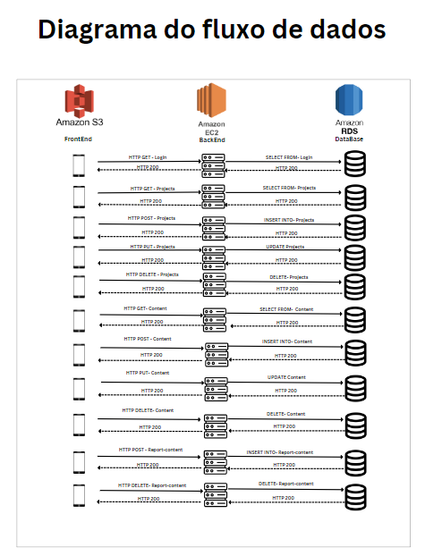
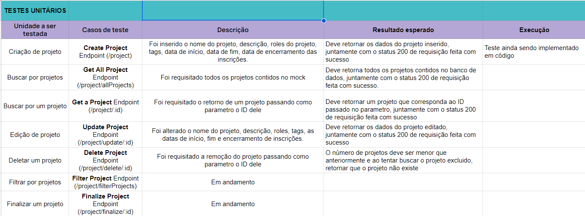

<table>
<tr>
<table>
<tr>
<td>

</td>
<td>
</td>
</tr>
</table>

. Nome do Projeto: Aplicativo desenvolvimento mobile  
. Nome do Parceiro: Dell Tecnologies  
. Nome do Grupo: DellHub  
. Integrantes do grupo:
 Emanuel De Oliveira Costa,
  Felipe Saadi Siegert,
  João Lucas Delistoianov Gonzalez,
  Julia Rodrigues Togni,
  Lívia Mattoso Bonotto Cabral,
  Marcelo Gomes Feitoza,
  Marcos Aurélio Florêncio da Silva.

Template do Documento do Projeto
Módulo 6 - Engenharia de Software
Solução de otimização de corte de bobinas de papel

>*Observação 1: A estrutura inicial deste documento é só um exemplo. O seu ar deverá alterar esta estrutura de acordo com o que está sendo solicitado nos artefatos.*

>*Observação 2: O índice abaixo não precisa ser editado se você utilizar o Visual Studio Code com a extensão **Markdown All in One**. Essa extensão atualiza o índice automaticamente quando o arquivo é salvo.*

**Conteúdo**

- [Visão Geral do Projeto](#visão-geral-do-projeto)
  - [Parceiro de Negócios](#parceiro-de-negócios)
  - [Problema](#problema)
    - [Análise do Problema](#análise-do-problema)
    - [Análise da Indústria](#análise-da-indústria)
    - [Análise do cenário e Matriz SWOT](#análise-do-cenário-e-matriz-swot)
    - [Análise financeira do projeto](#análise-financeira-do-projeto)
    - [Proposta de Valor e Value Proposition Canvas](#proposta-de-valor-e-value-proposition-canvas)
    - [Matriz de Risco](#matriz-de-risco)
    - [Matriz de Oceano Azul](#matriz-de-oceano-azul)
  - [Descritivo da Solução](#descritivo-da-solução)
    - [Objetivos](#objetivos)
      - [Objetivos gerais](#objetivos-gerais)
      - [Objetivos específicos](#objetivos-específicos)
    - [Justificativa](#justificativa)
  - [Partes Interessadas](#partes-interessadas)
- [Requisitos](#requisitos)
  - [Mapeamento do processo em alto nível](#mapeamento-do-processo-em-alto-nível)
  - [Requisitos Funcionais](#requisitos-funcionais)
  - [Requisitos não Funcionais](#requisitos-não-funcionais)
  - [Casos de Uso](#casos-de-uso)
- [Fluxograma de casos de uso](#fluxograma-de-casos-de-uso)
  - [Matriz de Ratreabilidade](#matriz-de-ratreabilidade)
  - [Perfis de Usuários](#perfis-de-usuários)
- [Arquitetura do Sistema](#arquitetura-do-sistema)
  - [Arquitetura do sistema V1:](#arquitetura-do-sistema-v1)
  - [Arquitetura do sistema V2:](#arquitetura-do-sistema-v2)
  - [Arquitetura do sistema V3:](#arquitetura-do-sistema-v3)
  - [Diagrama do fluxo de dados V1:](#diagrama-do-fluxo-de-dados-v1)
- [UX e UI Design](#ux-e-ui-design)
  - [Wireframes](#wireframes)
  - [Guia de Estilos](#guia-de-estilos)
  - [Benchmarking de Design Systems](#benchmarking-de-design-systems)
- [Projeto de Banco de Dados](#projeto-de-banco-de-dados)
  - [Modelo Conceitual](#modelo-conceitual)
  - [Modelo Lógico](#modelo-lógico)
- [Testes de Software](#testes-de-software)
  - [Teste Unitário](#teste-unitário)
  - [Teste de Integração](#teste-de-integração)
  - [Teste de Regressão](#teste-de-regressão)
  - [Teste de Usabilidade](#teste-de-usabilidade)
  - [Teste de Funcionalidade](#teste-de-funcionalidade)
  - [Teste de API](#teste-de-api)
- [Documentação da API](#documentação-da-api)
- [Pipeline ETL](#pipeline-etl)
- [Manual do Usuário](#manual-do-usuário)
- [Referências](#referências)
- [Apêndice](#apêndice)

# Visão Geral do Projeto
	

## Parceiro de Negócios
A Dell, uma empresa global de tecnologia com sede no Texas (EUA), é reconhecida como uma das maiores companhias de tecnologia do planeta e exerce uma posição dominante no mercado brasileiro. Fundada em 1984 por Michael Dell, a empresa inicialmente comercializava computadores pessoais diretamente aos consumidores e rapidamente se estabeleceu como um dos principais fabricantes mundiais de computadores.
A empresa possui uma sólida presença global, operando em diversos países e atendendo a uma extensa base de clientes em setores como saúde, governo, educação e negócios. Além disso, a Dell é conhecida por seu compromisso com a inovação e a sustentabilidade, investindo em tecnologias verdes e soluções energeticamente eficientes.
No momento atual, a Dell oferece uma ampla variedade de produtos e soluções tecnológicas, incluindo computadores pessoais, periféricos, servidores, dispositivos de armazenamento, soluções de segurança e outros equipamentos tecnológicos. Além disso, a empresa fornece serviços de suporte e consultoria, incluindo soluções personalizadas para empresas, que atualmente representam a maior parte de seu faturamento.
A fim de demonstrar sua posição de liderança, o relatório IDC Quarterly Personal Computing Device Tracker revelou que a Dell foi a empresa líder em vendas durante o ano de 2021, superando concorrentes renomadas como Samsung, Lenovo e Acer. Em relação às vendas em 2020, a Dell registrou um crescimento de 23,8% no último trimestre de 2021.

 

## Problema
Nesta seção, serão apresentados os problemas identificados e as necessidades do usuário, bem como uma avaliação da situação atual e as possíveis soluções para cada questão. Além disso, serão identificados os obstáculos e limitações do projeto, a fim de assegurar que todas as preocupações sejam abordadas antes do início da implementação. A Análise do Problema é essencial para garantir que a solução do software seja eficaz e atenda às necessidades dos usuários. É importante que seja realizada uma pesquisa exaustiva e que todas as perspectivas sejam consideradas para garantir que a solução seja bem-sucedida.

 

### Análise do Problema
Um dos problemas enfrentados pela Dell é o de reter talentos na empresa, visto que muitos profissionais sentem a necessidade de aprender novos assuntos e não encontram uma oportunidade de aprendizado na empresa, visto que os projetos internos não são amplamente divulgados e, por não haver um time formado, não são levados adiante. Com isso, surge o problema da falta de divulgação desses projetos em aberto para que pessoas da própria Dell tenham a oportunidade de participar e ter novas experiências. 
Destaca-se, também, a dificuldade em encontrar assuntos relevantes em meio a tantas fontes de informação, o que dificulta que esse funcionário encontre conteúdos personalizados ao seu perfil de interesse. A partir dessa problemática, há ainda a desmotivação do funcionário ao utilizar plataformas de aprendizado, há a necessidade de ferramentas mais engajadoras e descontraídas. 
A partir dessas problemáticas, surge a necessidade de desenvolver uma solução engajadora e amigável que permita o compartilhamento de projetos internos e de conteúdos relevantes, dando a oportunidade do usuário interagir com os conteúdos e receber recomendações de conteúdos e projetos de acordo com o seu perfil. 

 

### Análise da Indústria

TODO ANÁLISE DA INDÚSTRIA (é necessário fazer?)
Análise da indústria (Modelo de 5 Forças de Porter) em relação ao cenário da empresa parceira.

 

### Análise do cenário e Matriz SWOT

A Dell Technologies é uma empresa multinacional de tecnologia americana que oferece uma ampla variedade de produtos e serviços, incluindo computadores, servidores, armazenamento de dados, redes, software e soluções de segurança. A empresa foi fundada em 1984 por Michael Dell e é atualmente uma das maiores empresas de tecnologia do mundo.
O mercado de tecnologia está em constante evolução e a concorrência é intensa. A Dell Technologies enfrenta concorrência de outras grandes empresas de tecnologia, como a HP Inc., Lenovo e Apple, bem como de empresas emergentes que oferecem produtos e serviços inovadores.

A análise SWOT é uma ferramenta de planejamento estratégico que ajuda a identificar as forças, fraquezas, oportunidades e ameaças de uma empresa ou projeto. Essa análise permite que avaliamos a Dell e seu posicionamento no mercado e desenvolva estratégias para melhorar sua posição competitiva.

<a href="https://docs.google.com/document/d/1yJOVA0Lo0rHtoKidqWhYDMFjBXXj1LARBgohlgZk9Ik/edit?usp=sharing">
  Link da análise swot.
</a>

 

### Análise financeira do projeto
A análise financeira do projeto é a avaliação sistemática das informações financeiras e econômicas relacionadas a um projeto. É utilizado para avaliar a viabilidade financeira de um projeto, considerando seus custos e benefícios ao longo do tempo. Dessa forma, realizar essa análise no projeto da Dell ajuda a estimar o custo com desenvolvedores e serviços em cloud e assim, prosseguir e ajudar a definir os investimentos necessários. Também ajuda a determinar a estrutura de financiamento mais adequada para o projeto e a avaliar o seu desempenho financeiro ao longo do projeto

<a href="https://docs.google.com/spreadsheets/d/1k5JqLywyi4KK6r3jXJmujw_Ilqd6i4GMYNOsI5SMET4/edit#gid=0">
  Link da análise financeira.
</a>

 

### Proposta de Valor e Value Proposition Canvas
O Canvas de Proposta de Valor é uma ferramenta que auxilia na exploração mais aprofundada da relação entre produto e cliente por meio do detalhamento da solução e dos clientes, permitindo observar os principais benefícios e destaques do produto e possíveis pontos de melhorias.

<a href="https://www.figma.com/file/wB3ODv1lq5WcRQpHaIrv9n/Value-Proposition-Canvas---G5-M6?node-id=861-74&t=AbxH6HWxiy78ovUV-0">
  Link do Value Proposition Canvas.
</a>

 

### Matriz de Risco

A partir do escopo geral do projeto, foi elaborada uma matriz de riscos, onde foram pontuadas possíveis oportunidades e riscos para o desenvolvimento do projeto a partir de observações feitas em um primeiro momento. Dessa forma, é possível observar o impacto dessas possibilidades na performance do produto e do projeto, além de uma classificação da probabilidade de acontecerem. A partir da atualização e análise constante da matriz, será possível mitigar ou evitar que os cenários de risco ocorram durante o projeto.

<a href="https://docs.google.com/spreadsheets/d/1FMFbKFAxigFDO9KlahrsahnO4_PfPoTVvx7aFA9tdmo/edit#gid=0">
  Link da Matriz de Risco.
</a>

 

### Matriz de Oceano Azul
O objetivo da matriz de oceano azul é ajudar as empresas a identificar oportunidades de mercado inexploradas e criar novos espaços de mercado únicos para oferecer valor único aos seus clientes e aumentar a rentabilidade. A empresa pode explorar a matriz, buscando áreas onde possa inovar sem competição direta ou onde a concorrência é limitada e pode explorar novas oportunidades. Ao criar um oceano azul, a Dell Tecnologias pode reduzir  uma possível concorrência e aumentar a margem de lucro.

 

## Descritivo da Solução

Solução proposta: Aplicativo de Compartilhamento e Acesso a Projetos para Funcionários Dell

O aplicativo proposto tem como objetivo permitir que os funcionários da Dell compartilhem assuntos de seu interesse, bem como links e imagens, e tenham acesso a projetos em aberto na empresa. Além disso, o aplicativo utilizará inteligência artificial para recomendar projetos que sejam relevantes e adequados ao perfil de cada usuário.

- Principais funcionalidades:

Compartilhamento de assuntos: Os funcionários poderão criar postagens para compartilhar tópicos que acham interessantes. Isso pode incluir artigos, notícias, links ou qualquer outro conteúdo relevante para a empresa e sua área de atuação.

Acesso a projetos abertos: Os funcionários poderão explorar e acessar projetos que estão abertos na empresa. Esses projetos podem ser de diferentes áreas e departamentos, e os usuários poderão acompanhar seu progresso, envolver-se em discussões e colaborar, se desejado.

Recomendação de projetos: O aplicativo utilizará inteligência artificial para analisar o perfil de cada usuário, considerando suas habilidades, experiências anteriores, interesses e preferências. Com base nessa análise, o sistema recomendará projetos que sejam mais relevantes e adequados a cada funcionário, ajudando-os a descobrir novas oportunidades e contribuir para projetos alinhados aos seus interesses e habilidades.

- Como usar o aplicativo:

Registro e criação de perfil: Os funcionários farão o registro no aplicativo usando suas credenciais da Dell. Eles serão solicitados a criar um perfil, fornecendo informações sobre suas áreas de interesse logo no primeiro contato com o aplicativo.

Explorar assuntos e compartilhar: Os usuários poderão explorar as postagens compartilhadas pelos colegas atrvés de um feed, lá poderam filtrar por categorias, palavras-chave ou tópicos de interesse. Eles também poderão criar suas próprias postagens, compartilhando conteúdo relevante com a comunidade.

Acessar e colaborar em projetos: Os funcionários poderão navegar pela lista de projetos abertos, visualizar detalhes sobre cada projeto, como descrição e vagas disponíveis. Eles poderão se candidatar às vagas e assim, colaborar em projetos de seu interesse.

Recomendações personalizadas: O aplicativo fornecerá uma seção de recomendações, onde os usuários poderão encontrar projetos recomendados com base em seu perfil e preferências, nesses terão um selo de 'match' para ajudar o usuário a identificá-los. Eles poderão explorar essas recomendações e decidir se desejam participar ou obter mais informações sobre os projetos sugeridos.

 

### Objetivos

#### Objetivos gerais
- Desenvolver uma plataforma digital para os funcionários da Dell compartilharem assuntos de interesse e terem acesso a projetos abertos na empresa.
- Incentivar o crescimento e a retenção dos funcionários, proporcionando um ambiente de colaboração e aprendizado.
- Melhorar a comunicação interna e o compartilhamento de conhecimento entre os funcionários.

#### Objetivos específicos
- Permitir que os funcionários compartilhem conteúdo relevante, como artigos, links e imagens, em uma plataforma centralizada.
- Facilitar o acesso dos funcionários a projetos temporários abertos na empresa, proporcionando uma visão clara dos projetos, seus objetivos e vagas disponíveis.
- Utilizar inteligência artificial para recomendar projetos que sejam adequados ao perfil e interesses do funcionário.
- Estimular a participação ativa dos funcionários por meio de recursos de interação, como comentários, curtidas e compartilhamento de ideias.
- Promover a colaboração entre os funcionários, permitindo que eles se envolvam em discussões, comunidades e contribuam com suas habilidades e conhecimentos.
- Criar um ambiente de aprendizado contínuo, onde os funcionários possam aprender com o compartilhamento de experiências e participação em projetos desafiadores.
- Monitorar o engajamento dos funcionários na plataforma, pelos perfis de mediador, e coletar feedback para melhorar continuamente a experiência do usuário e as funcionalidades oferecidas.

### Justificativa

Qual o tipo de arquitetura de nuvem escolhida e sua justificativa
Como arquitetura de nuvem escolhida deverá ser utilizada
Quais os benefícios trazidos pela arquitetura de nuvem proposta

## Partes Interessadas 

Descrever os principais stakeholders envolvidos no projeto e seus papéis.

# Requisitos

Esta seção é importante porque permite que os desenvolvedores entendam claramente o que é esperado do software e quais serão as restrições e desafios enfrentados durante o desenvolvimento. Além disso, permite que os usuários finais saibam se o software atende às suas expectativas e se está adequado ao seu ambiente de trabalho.

A seção de requisitos do sistema é atualizada constantemente durante o ciclo de desenvolvimento do software, garantindo que todas as necessidades e especificações estejam sempre atualizadas.

## Mapeamento do processo em alto nível

Esta seção é responsável por mostrar todo o fluxo de processos da aplicação, facilitando o entendimento do fluxo de trabalho e entendimento da aplicação como um todo.

 

<picture>

<legend><strong>Criação de conteúdo</strong></legend>

</picture>

 

<picture>

<legend><strong>Edição de conteúdo</strong></legend>

</picture>

 

<picture>

<legend><strong>Remoção de conteúdo</strong></legend>

</picture>

 

<picture>

<legend><strong>Denuncia de conteúdo</strong></legend>

</picture>

 

<picture>

<legend><strong>Criação de projeto</strong></legend>

</picture>

 

<picture>

<legend><strong>Aprovação de projeto</strong></legend>

</picture>

 

<picture>

<legend><strong>Edição de projeto</strong></legend>

</picture>

 

<picture>

<legend><strong>Remoção de projeto</strong></legend>

</picture>

 

<a href="https://drive.google.com/file/d/1j2Ik02OfCWQiwnE5S1We6IuDW__ADTo5/view?usp=sharing">
  Link do mapeamento de processos
</a>

 

## Requisitos Funcionais
Esta seção da documentação do software fornece uma descrição detalhada dos requisitos do sistema. Ela inclui informações sobre as funcionalidades esperadas do software, as restrições e limitações do sistema e outras especificações relevantes.

 

## Requisitos não Funcionais

  
  

 

## Casos de Uso

A seção de casos de uso da documentação de software é uma parte crucial que descreve as funcionalidades 
do software e como elas serão utilizadas pelos usuários. Aqui, são listados todos os cenários possíveis de uso do software, incluindo as ações que o usuário pode realizar, as interações com o sistema e os resultados esperados. Os casos de uso são descritos em detalhes, incluindo a descrição do objetivo da funcionalidade, as entradas de dados, as ações do usuário e os resultados esperados. Além disso, também são incluídos os critérios de aceitação, que são os padrões que o software precisa atender para ser considerado como funcionando corretamente.

<a href="./assets/user-stories/user-stories.pdf">
Link para User Stories detalhadas</a>

<a href="https://docs.google.com/spreadsheets/d/1e9aWhXz67T5jla8nRPAbVWR8u6_57sKMgWBk40O_KxY/edit?usp=sharing">Link para User Stories resumidas</a>

 

# Fluxograma de casos de uso 

<a href="./assets/user-stories/fluxograma-uc.pdf">Link para o Fluxograma</a>

 

## Matriz de Ratreabilidade
Na tabela a seguir, foram listados os requisitos, os casos de uso e ao final foi elaborada a tabela de rastreabilidade de requisitos funcionais e não funciona em relação ao casos de uso.

Matriz de rastreabilidade para os requisitos funcionais:

Matriz de rastreabilidade para os requisitos não funcionais:

<a href="https://docs.google.com/spreadsheets/d/1e9aWhXz67T5jla8nRPAbVWR8u6_57sKMgWBk40O_KxY/edit?usp=sharing">
  Link da matriz de rastreabilidade.
</a>

 

## Perfis de Usuários 

A seção de perfil de usuário da documentação de software é responsável por descrever instruções detalhadas sobre o uso de cada opção e recursos relacionados ao perfil do usuário, garantindo uma experiência fácil e intuitiva para o usuário final.

 

# Arquitetura do Sistema

## Arquitetura do sistema V1:

 

## Arquitetura do sistema V2:

## Arquitetura do sistema V3:

 

## Diagrama do fluxo de dados V1:

<a href="./assets/arquitetura/arquitetura-infraestrutura-cloud.pdf">Link para a arquitetura</a> 

 

# UX e UI Design

Aborda o design e a funcionalidade da aplicação ou sistema em questão. Ela fornece informações sobre como o software é projetado para ser fácil de usar e intuitivo para os usuários. Nesta seção, deve ser possível encontrar descrições detalhadas sobre as principais características e recursos da interface do usuário, como botões, menus, ícones e outros elementos que são utilizados para facilitar a interação do usuário com o software. Além disso, são fornecidos exemplos de como as funcionalidades do software são acessadas e usadas pelos usuários, incluindo informações sobre os passos necessários para realizar tarefas específicas. Esta seção também aborda as principais preocupações de UX, como acessibilidade, usabilidade, consistência e simplicidade. São apresentados exemplos de como o software é projetado para atender às necessidades dos usuários com diferentes tipos de habilidades e recursos.

## Wireframes
O desenvolvimento da aplicação tem como prioridade a interatividade e usabilidade, visto que a maior preocupação é criar uma plataforma de fácil entendimento para os usuários, com as funcionalidades necessárias. Além disso, foi elaborada uma ideia de gamificação proposta pelo parceiro.

Assim, uma primeira versão da solução proposta de interface mobile foi prototipada na plataforma Figma e pode ser acessada através do seguinte endereço: <a href="https://www.figma.com/file/cLznFm8xajrbxyqVEKE8da/DellHub?node-id=0-1&t=MvWd3RhCig4XBaMV-0"> Protótipo Interface Mobile </a>. É recomendado o acesso ao Figma para uma visualização melhor qualidade e detalhamento dos objetivos de cada tela. Para visualizar com interação com os botões, basta fazer o atalho do teclado “Ctrl + Alt + Enter” ou basta <a href="https://www.figma.com/proto/cLznFm8xajrbxyqVEKE8da/DellHub?node-id=1-10&scaling=scale-down&page-id=0%3A1&starting-point-node-id=1%3A10&show-proto-sidebar=1"> clicar aqui. </a>

Telas e features pendentes: 
- Telas de confirmação e erros;
- Filtros;
- Dashboard para Managers e Moderadores;
- Modo escuro;
- Tela de notificação;
- Criação de perfil;
- FAQ e About;
- Configurações.

 

## Guia de Estilos

O link a seguir dará acesso ao guia de estilos desenvolvido para o projeto e que segue, em sua maioria, os padrões do Dell Design System.

<a href="https://www.figma.com/file/XwY8Q3XWazGLRDzCBPN2xM/Style-Guide-Sprint-3?node-id=294%3A2896&t=M85J2JGabpMNqBbr-1">
  Link Guia de Estilos
</a>

 

## Benchmarking de Design Systems
Design System consiste em conjuntos de bibliotecas reutilizáveis que são usados para criar e manter a padronização dos produtos de uma empresa, além de reduzir o retrabalho de desenvolvedores e designers.
O Design System garante que todos os aspectos do design, (como cores, tipografia, componentes, interação com o produto e seu comportamento) sejam coesos e consistentes em todas as plataformas e produtos de uma empresa.

A estrutura do Design System se baseia em blocos de construção (paletas de cor, tipografia, grid e ícones), bibliotecas de padrões (templates, módulos, componentes e elementos) e regras (design, guidelines, componentes e elementos), compondo o guia de estilos.

<a href="https://docs.google.com/spreadsheets/d/1oTFCLJUo3UDkt5zDLPFDjmQW5Oju5LLC35BEhbmIWk0/edit?usp=sharing">
  Link para o Benchmark.
</a>

 

# Projeto de Banco de Dados

Documento contendo diagrama de entidades e relacionamentos do banco de dados

## Modelo Conceitual

O modelo conceitual deve garantir uma conexão com a realidade. Os 4 tipos de conexões com a realidade são:
conceitos
atributos
identificações
associações
O Modelo Entidade-Relacionamento - MER
entidades e tipos de entidades
atributos e tipos de atributos
relacionamentos e tipos de relacionamentos

<a href="https://drive.google.com/file/d/1v1IXMW7uAAsw0M5IhTLJCCsU0Sp2ZY00/view?usp=sharing">
  Link para o modelo conceitual.
</a>

## Modelo Lógico 

O modelo lógico de banco de dados é uma representação abstrata e simplificada dos dados armazenados no sistema. É utilizado para entender como os dados são relacionados e para garantir a integridade e consistência dos dados armazenados. Incluir  uma descrição detalhada das tabelas, campos e relações presentes no modelo lógico de banco de dados. Também serão apresentadas as regras de negócio e as restrições aplicadas aos dados para garantir a integridade e a consistência dos dados armazenados.

<a href="https://drive.google.com/file/d/1jpMAOMcKiCyIXAFKJP1DIk1QhWYUIm52/view?usp=share_link">
  Link para o modelo lógico.
</a>

# Testes de Software

## Teste Unitário
	
<picture>

<legend><strong>Testes unitário de controller de projects</strong></legend>

</picture>
<a href="https://docs.google.com/spreadsheets/d/1mrAFxO9Qp-5RFOWCoPFYgBfhC6nM2G5UuOj2t12poiQ/edit?usp=sharing">
  Link do sheets.
</a>
  

  
	
<picture>

<legend><strong>Testes unitário de service de projects</strong></legend>

</picture>
<a href="https://docs.google.com/spreadsheets/d/1mrAFxO9Qp-5RFOWCoPFYgBfhC6nM2G5UuOj2t12poiQ/edit?usp=sharing">
  Link do sheets.
</a>
	
  

<picture>

<legend><strong>Testes unitários de controller de user</strong></legend>

</picture>
<a href="https://docs.google.com/spreadsheets/d/1KHLiFU7qy2FTXfq8RHJJ6ibNohmpY39e1eltCKkAmok/edit?usp=sharing">
  Link do sheets.
</a>
	
  

<picture>

<legend><strong>Testes unitários de service de user</strong></legend>

</picture>
<a href="https://docs.google.com/spreadsheets/d/1KHLiFU7qy2FTXfq8RHJJ6ibNohmpY39e1eltCKkAmok/edit?usp=sharing">
  Link do sheets.
</a>
	
  

  

<picture>

<legend><strong>Testes unitários de controller do post</strong></legend>

</picture>
<a href="https://docs.google.com/spreadsheets/d/1z4JhLFVoyi40192TTelwPLH1jH47_R_8JPXFt0gsnS8/edit?usp=sharing">
  Link do sheets.
</a>
	
  

  

<picture>

<legend><strong>Testes unitários de service do post</strong></legend>

</picture>
<a href="https://docs.google.com/spreadsheets/d/1z4JhLFVoyi40192TTelwPLH1jH47_R_8JPXFt0gsnS8/edit?usp=sharing">
  Link do sheets.
</a>
	
 

## Teste de Integração

<picture>

<legend><strong>Testes de integração de projects</strong></legend>

</picture>
<a href="https://docs.google.com/spreadsheets/d/1mrAFxO9Qp-5RFOWCoPFYgBfhC6nM2G5UuOj2t12poiQ/edit?usp=sharing">
  Link do sheets.
</a>
	
  

<picture>

<legend><strong>Testes de integração de user</strong></legend>

</picture>
<a href="https://docs.google.com/spreadsheets/d/1KHLiFU7qy2FTXfq8RHJJ6ibNohmpY39e1eltCKkAmok/edit?usp=sharing">
  Link do sheets.
</a>
	
  

  

<legend><strong>Testes de integração de post</strong></legend>

</picture>
<a href="https://docs.google.com/spreadsheets/d/1z4JhLFVoyi40192TTelwPLH1jH47_R_8JPXFt0gsnS8/edit?usp=sharing">
  Link do sheets.
</a>
	
  

# Testes do Modelo de Recomendação

## Teste do modelo no terminal com várias requisições
	
<picture>

<legend><strong>Teste da recomendação</strong></legend>

</picture>
<legend><strong>Resposta na mensageria(MQTT)</strong></legend>

</picture>
<a href="https://drive.google.com/drive/folders/1DbiSvnHDL7VRm_zAifG4LYtbuQWQ5cdG?usp=sharing">
  Link do drive.
</a>

<picture>
  

## Teste de Regressão

Link ou imagem da tabela com dados organizados dos testes realizados

## Teste de Usabilidade 

Link ou imagem da tabela com dados organizados dos testes realizados

## Teste de Funcionalidade

<picture>

<legend><strong>Testes de funcionalidade de projects</strong></legend>

</picture>

	
<a href="https://docs.google.com/spreadsheets/d/1mrAFxO9Qp-5RFOWCoPFYgBfhC6nM2G5UuOj2t12poiQ/edit?usp=sharing">
  Link do sheets.
</a>
	
  

<picture>

<legend><strong>Testes de funcionalidade de user</strong></legend>

</picture>
<a href="https://docs.google.com/spreadsheets/d/1KHLiFU7qy2FTXfq8RHJJ6ibNohmpY39e1eltCKkAmok/edit?usp=sharing">
  Link do sheets.
</a>
	
  

  

<picture>

<legend><strong>Testes de funcionalidade de post</strong></legend>

</picture>
<a href="https://docs.google.com/spreadsheets/d/1z4JhLFVoyi40192TTelwPLH1jH47_R_8JPXFt0gsnS8/edit?usp=sharing">
  Link do sheets.
</a>
	
  

## Teste de API 

Link ou imagem da tabela com dados organizados dos testes realizados

# Documentação da API

Documentação dos Endpoints com o uso de Postman para testes

 

<picture>

<legend><strong>Create post</strong></legend>

</picture>

 

<picture>

<legend><strong>Get all posts</strong></legend>

</picture>

 

<picture>

<legend><strong>Get a post</strong></legend>

</picture>

 

<picture>

<legend><strong>Create project</strong></legend>

</picture>

 

<picture>

<legend><strong>Get all projects</strong></legend>

</picture>

 

<picture>

<legend><strong>Get a project</strong></legend>

</picture>

 

<picture>

<legend><strong>Create user</strong></legend>

</picture>

 

<picture>

<legend><strong>Get all users</strong></legend>

</picture>

 

<picture>

<legend><strong>Get a user</strong></legend>

</picture>

 

# Pipeline ETL

<a href="https://lucid.app/lucidchart/efcaa2ae-f241-464c-9a9b-28f431696fa7/edit?viewport_loc=-893%2C-255%2C4286%2C2212%2C0_0&invitationId=inv_6fd5ae69-5e54-4359-8b10-f372980fbd6c">
  Link para a arquitetura do Pipeline
</a>

 

# Manual do Usuário

Fornecer instruções detalhadas sobre como usar o software corretamente. É uma ferramenta valiosa para ajudar os usuários a compreender as funções do software, instalar o software, configurar as preferências do usuário, entre outras tarefas. O manual do usuário geralmente inclui screenshots, animações e outros recursos visuais para tornar a experiência do usuário mais clara e intuitiva. Além disso, ele também pode incluir informações sobre solução de problemas, dicas e truques, bem como informações de contato para suporte técnico. É importante que a seção de manual do usuário seja atualizada frequentemente para garantir que os usuários tenham acesso à informação mais recente e precisa sobre o software.

 

# Referências

Toda referência citada no texto deverá constar nessa seção, utilizando o padrão de normalização da ABNT - ABNT NBR 10520). As citações devem ser confiáveis e relevantes para o trabalho. São imprescindíveis as citações dos sites de download das ferramentas utilizadas, bem como a citação de algum objeto, música, textura ou outros que não tenham sido produzidos pelo grupo, mas utilizados (mesmo no caso de licenças gratuitas, royalty free ou similares)
Sugerimos o uso do sistema autor-data para citações.

# Apêndice 

Os apêndices representam informações adicionais que não caberiam no documento exposto acima, mas que são importantes por alguma razão específica do projeto. 
